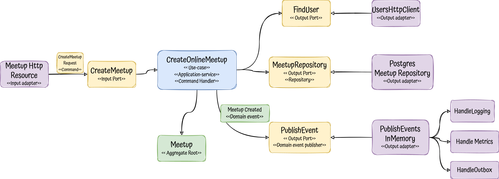

# Meetups microservice: Applying tactical DDD 

## Description

This project is a practical example to understand the tactical patterns/building-blocks that domain-driven design provides 
at code level.

In addition to that, it brings a full tested and production ready microservice that could be used as a blueprint to develop
services with DDD and hexagonal architecture.

Keywords: `Tactical DDD`, `microservice`, `kotlin`, `Quarkus`, `Hexagonal-Architecture`, `SOLID`, `Domain-Driven Design`, `functional-programming`,
`Testing`, `Event-Driven Architecture`, `Domain-Events`, `Kafka`, `PostgreSQL`, `Transactional-outbox`, `jdbi`, `optimistic-locking`

## The problem to solve

To drive all the project, we need a problem to solve, in this case we will get inspiration on the famous [meetup](https://www.meetup.com/) platform.

The basics are:
- As a host, I should be able to create a **Meetup** to talk about some topic at some date in the future
- If I get sick, as a host, I would like to cancel it ;-)
- We can add attendants to the meetups
- Meetups can be in-place somewhere or online in any platform
- Once a meetup has finished, an attendant can rate it
- Meetings can be part of a **group**
- Groups could have members
- Both group and meetups should have limitations on text sizes

We will model these problems using DDD tactical patterns to structure our solution around the business.

In addition, this project will use **Hexagonal Architecture** as an architectural style and **functional programming principles**.

## Building blocks

  

- [**Aggregates**](https://martinfowler.com/bliki/DDD_Aggregate.html) are a cluster of objects that acts as a single unit, each aggregate has: 
  - Root: single entity that follow some rules such as:
    - All business operations should go through it
    - As the name suggest, is in the root of the objects tree, therefore it should control the access to its child
    - Keeps everything inside in a consistent state ensuring the integrity of their invariants
    - Is the basic element of data storage, either you load or save it as a whole 
  - Boundary: that defines what is inside and:
    - Has a global identity, the root, and any entity inside has a local identity
    - Nothing outside the aggregate boundary can hold a reference to anything inside, except for the aggregate root
    - Objects inside the boundary could hold references to other aggregates, preferable weak references (ids)
    
- **Entities** are objects defined is defined by their identity, independently of the value of their properties. Usually,
    their state could change during their lifecycle. For example, a Person, it could be identified by their doc id, but they 
    will change during their life in many ways.
- [**Value Objects**](https://martinfowler.com/bliki/ValueObject.html) are immutable types and their equality is defined 
    by all their properties together. Examples of VO could be a Currency, Address or UserId.
    A subset of Values objects are called:
  - Tiny types: A very lightweight value object with only one value, wrapping a primitive type.
- A **Factory** encapsulates: 
  - Creation: the creation of an aggregate, ensuring the integrity of it.
  - Reconstitution: At some point, most of the objects got stored somewhere, factories should be the point to reassemble 
    it when the object is retrieved.
    
  _Note:_ A factory could be just a constructor, a function or a separate object when the creation is complex.
- **Commands** are requests for changes in an aggregate, they could be just methods in the root or objects themselves. 
- **Domain events** are triggered when an aggregate changes and is important from business perspective, they are the way to notify other aggregates or systems about changes.
- **Repositories** are abstractions that allow us to load and store our aggregates without knowing about datasource impl details under the hood.

**_Important:_** All these patterns talk business domain, they should be decoupled from the external world and shouldn't be polluted with 
infrastructure concerns such as persistence libraries, dtos from outside the domain, http concerns, messaging platforms and so on.

### The Meetup model

Usually microservices are around one aggregate, but in this case the MS is going to handle two, potentially the service 
could be split up if necessary: 

  

  

> Wait ... where are commands, domain events and repositories? Or even more, what about other external dependencies like 
> other services, queues, streams, logs or metrics? where are they fitting?

We have an amazing and clean domain, easy, right? But a real world application needs to be operative, it means that we 
would need to:

- Expose entry-points to communicate with our domain, such as http, streams or grpc
- Store our aggregates in a datastore
- Call other services that we can depend on
- Perform other side effects like write logs, send metrics or publish events

That's when **we need an architectural style** to support these different concerns in a structured way and decouple our 
domain operations, right? take a look on the next section.

## Hexagonal architecture

[Hexagonal architecture](https://github.com/albertllousas/implementing-hexagonal-architecture) is an architectural style  
that fits perfectly for domain isolation, hence, for DDD projects. 

  

Hexagonal introduces a chassis for our app, a way by which we can organise our code and do a proper separation of concerns.

### Package structure

- Application: Application Services (the use cases of our app)
- Domain: Domain model and ports.
- Infrastructure: Adapters, configuration and infrastructure code.

### Accessing to the meetups: Queries

If you take a look in the application service layer you will see that there are no use-cases to access to the aggregates.
This is done in purpose in order to:
- Empower async microservices approach.
- Separate writes (business operations on our aggregates) from reads (just projections/views of them).
- Don't pollute our aggregates with view information at persistence level such as foreign keys or extra info to be queried.

Our microservice is publishing events about all the lifecycle, if a **client** wants to get either a meetup or a group, they 
**would need to subscribe to the stream and replicate the information**.

Anyways, if for any reason you want to expose synchronous endpoints, there are several ways:
- [CQRS](https://martinfowler.com/bliki/CQRS.html) way: create a separate project or module, listen to the events and create proper read models to be queried (views) 
- Query handlers: Create query handlers, similar to use cases with a different meanings, just aggregate information and present views models
- Access repositories in the controllers: Access repositories right away, is a view a business concern?
- Just another use-case: treat queries/reads as another use-case more, keeping consistency in the project.

## Events

### Messaging patterns

In order to avoid [dual writes](https://thorben-janssen.com/dual-writes/) the project uses a couple of patterns:
- [transactional-outbox](https://microservices.io/patterns/data/transactional-outbox.html)
- [polling-publisher](https://microservices.io/patterns/data/polling-publisher.html)

### Domain events

A Domain-event is something that happened in the domain that is important to the business.

This service advocates for asynchronous communication instead of exposing endpoints to be consumed by clients. To do so
, since the service uses also domain-driven design tactical patterns, all use-cases are producing domain-events:
[Domain events](/src/main/kotlin/alo/meetups/domain/model/DomainEvents.kt)

### Integration events

An integration event is a committed event that ocurred in the past within a bounded context which may be interesting to other
domains, applications or third party services, so it is the sibling of a domain event but for the external world.

Why not to publish our domain events directly? We can not publish our domain events directly for several reasons:
- Back-ward compatibility: We should provide a way to maintain backward compatibility, if we were publishing our domain events we would couple them to the external contracts.
- Different schema for messages: In almost all the companies using event-driven these messages are defined in a different schema such as avro, protobuf or json schema.
- We don't want to publish all domain-events: Sometimes we don't want to publish to our consumers all our internal domain events.

Here the [contracts](/src/main/kotlin/alo/meetups/infrastructure/adapters/output/pubsub/IntegrationTeamEvents.kt)

## Error Handling

This project uses a mixed approach to handle with errors:
- [Domain errors](src/main/kotlin/alo/meetups/domain/model/DomainErrors.kt): Domain errors are always returned for any meaningful error interesting for the consumer
that they can recover from. Domain errors are wrapped using **Either monads**.
- Exceptions: Let the application crash for uncontrolled errors such as framework exceptions, timeouts, sql exceptions or 
any infrastructure error that the consumer can not recover from and deal with them at the boundary of the app.

## Resources

- [Vaughn Vernon about designing aggregates](https://www.dddcommunity.org/library/vernon_2011/)

- https://encrypted-tbn0.gstatic.com/images?q=tbn:ANd9GcR29yQqJqQEa3huLXAYyoRdVKMHfwxlJk5tPA&usqp=CA

https://www.jamesmichaelhickey.com/consistency-boundary/

https://stackoverflow.com/questions/31574819/ddd-and-aggregate-transaction-boundary

FC / IS

OPTIMISTIC LOCKING
error handling: explanation
errors
