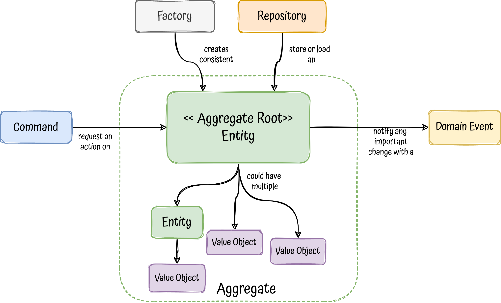
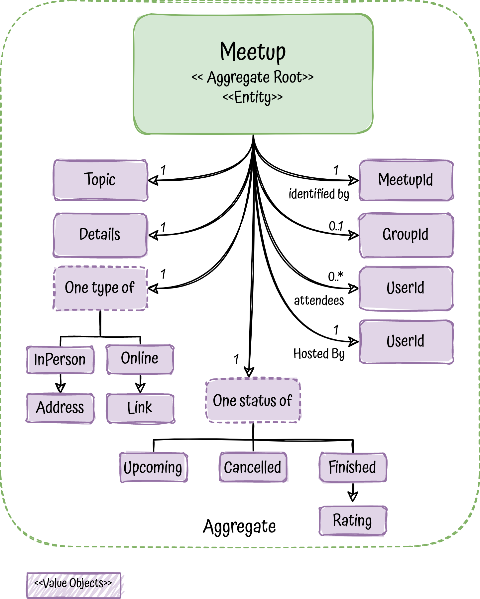
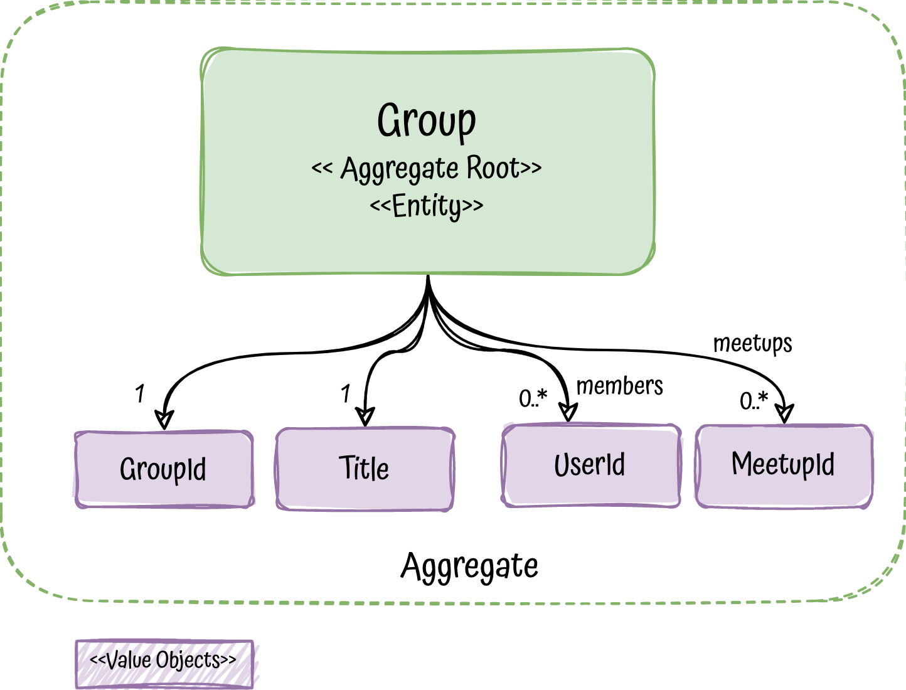

# Tactical DDD building blocks

## Description

This project is a practical example to understand the tactical patterns/building-blocks that domain-driven design provides 
at code level.

In addition to that, it brings a full tested and production ready microservice that could be used as a blueprint to develop
services with DDD and hexagonal architecture.

Keywords: `Tactical DDD`, `microservice`, `kotlin`, `Hexagonal-Architecture`, `SOLID`, `Domain-Driven Design`, `functional-programming`,
`Testing`, `Event-Driven Architecture`, `Domain-Events`, `Kafka`, `spring-boot`, `PostgreSQL`, `Transactional-outbox`

OPTIMISTIC LOCKING
transactions
Transactional Outbox

Tech Stack: kotlin, quarkus, jdbi, fuel
ponerlo en el de team management tb

## The problem to solve

To drive all the project, we need a problem to solve, in this case we will get inspiration on the famous [meetup](https://www.meetup.com/) platform.

The basics are:
- As a host, I should be able to create a **Meetup** to talk about some topic at some date in the future
- If I get sick, as a host, I would like to cancel it ;-)
- We can add attendants to the meetups
- Meetups can be in-place somewhere or online in any platform
- Once a meetup has finished, an attendant can rate it
- Meetings can be part of a **group**
- Groups could have members

We will model these problems using DDD tactical patterns to structure our solution around the business.

In addition, this project will use **Hexagonal Architecture** as an architectural style and **functional programming principles**.

## Building blocks

  

- [**Aggregates**](https://martinfowler.com/bliki/DDD_Aggregate.html) are a cluster of objects that acts as a single unit, each aggregate has: 
  - Root: single entity that follow some rules such as:
    - All business operations should go through it
    - As the name suggest, is in the root of the objects tree, therefore it should control the access to its child
    - Keeps everything inside in a consistent state ensuring the integrity of their invariants
    - Is the basic element of data storage, either you load or save it as a whole 
  - Boundary: that defines what is inside and:
    - Has a global identity, the root, and any entity inside has a local identity
    - Nothing outside the aggregate boundary can hold a reference to anything inside, except for the aggregate root
    - Objects inside the boundary could hold references to other aggregates, preferable weak references (ids)
    
- **Entities** are objects defined is defined by their identity, independently of the value of their properties. Usually,
    their state could change during their lifecycle. For example, a Person, it could be identified by their doc id, but they 
    will change during their life in many ways.
- [**Value Objects**](https://martinfowler.com/bliki/ValueObject.html) are immutable types and their equality is defined 
    by all their properties together. Examples of VO could be a Currency, Address or UserId.
    A subset of Values objects are called:
  - Tiny types: A very lightweight value object with only one value, wrapping a primitive type.
- A **Factory** encapsulates: 
  - Creation: the creation of an aggregate, ensuring the integrity of it.
  - Reconstitution: At some point, most of the objects got stored somewhere, factories should be the point to reassemble 
    it when the object is retrieved.
    
  _Note:_ A factory could be just a constructor, a function or a separate object when the creation is complex.
- **Commands** are requests for changes in an aggregate, they could be just methods in the root or objects themselves. 
- **Domain events** are triggered when an aggregate changes and is important from business perspective, they are the way to notify other aggregates or systems about changes.
- **Repositories** are abstractions that allow us to load and store our aggregates without knowing about datasource impl details under the hood.

**_Important:_** All these patterns talk business domain, they should be decoupled from the external world and shouldn't be polluted with 
infrastructure concerns such as persistence libraries, dtos from outside the domain, http concerns, messaging platforms and so on.

### The Meetup model

  

  

> Wait ... where are commands, domain events and repositories? Or even more, what about other external dependencies like 
> other services, queues, streams, logs or metrics? where are they fitting?

We have an amazing and clean domain, easy, right? But a real world application needs to be operative, it means that we 
would need to:

- Expose entry-points to communicate with our domain, such as http, streams or grpc
- Store our aggregates in a datastore
- Call other services that we depend on
- Perform other side effects like write logs, send metrics or publish events

That's when **we need an architectural style** to support these different concerns in a structured way and decouple our 
domain operations, right? take a look on the next section.

## Hexagonal architecture

side effects

usecases
reference the
usecase stateless, get explanation from bear

NOT use hexa when

## What about queries?

Options: 
- read side
- query handlers
- Repos in controllers
- Just another usecase

## Consistency Boundary

### Architectural shortcuts

## Error handling strategy

## Testing strategy

Add minimal explanation from gdoc

### Package structure

- Application: Application Services (the use cases)
- Domain: Domain model and ports.
- Infrastructure: Adapters, configuration and infrastructure code.

### Architectural shortcuts

Even though the project follows hexagonal architecture, it also takes some shortcuts, breaking consciously
some architectural constraints:

- **Skipping incoming ports**: Incoming adapters are accessing application services directly.

## Messaging patterns

In order to avoid [dual writes](https://thorben-janssen.com/dual-writes/) the project uses a couple of patterns:
- [transactional-outbox](https://microservices.io/patterns/data/transactional-outbox.html)
- [polling-publisher](https://microservices.io/patterns/data/polling-publisher.html)

Add everything

- https://encrypted-tbn0.gstatic.com/images?q=tbn:ANd9GcR29yQqJqQEa3huLXAYyoRdVKMHfwxlJk5tPA&usqp=CA

https://www.jamesmichaelhickey.com/consistency-boundary/

https://stackoverflow.com/questions/31574819/ddd-and-aggregate-transaction-boundary

FC / IS

## Resources

- [Vaughn Vernon about designing aggregates](https://www.dddcommunity.org/library/vernon_2011/)

